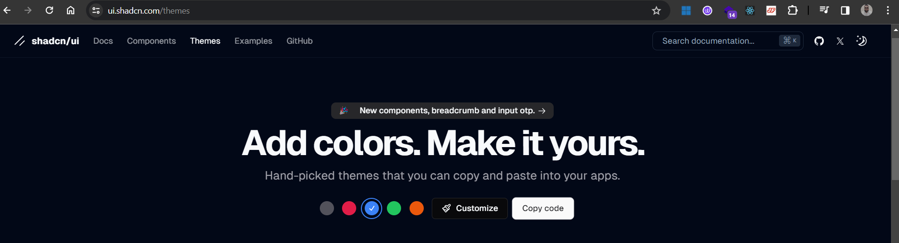
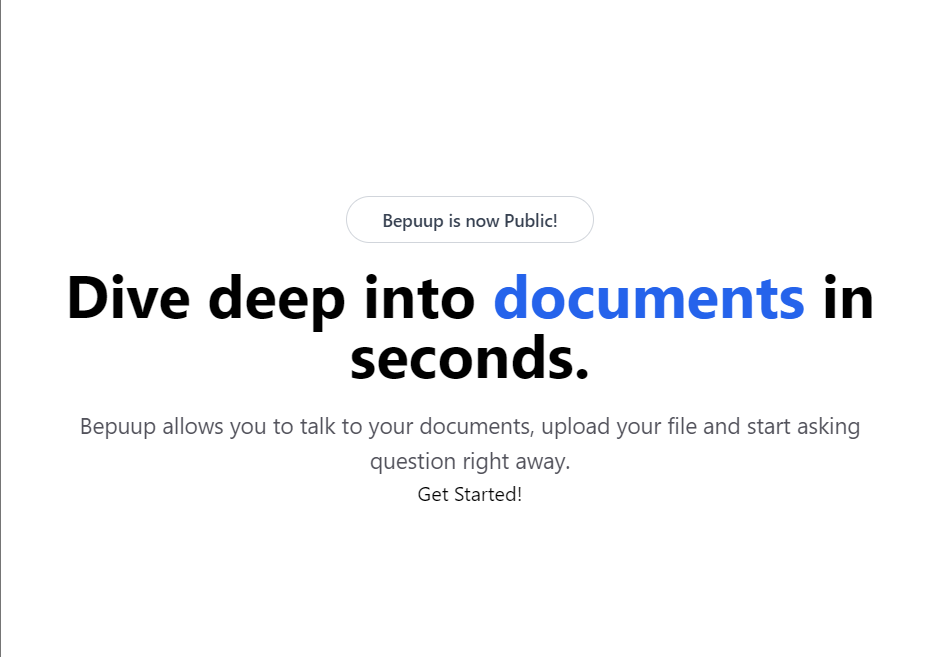

# NextJS SaaS

This project is to showcase my skill set in below tech stack:

| Javascript | CSS      | Other |
| ---------- | -------- | ----- |
| ReactJS    | Tailwind | pnpm  |
| NextJS     | clsx     |       |

## Installation

1. Clone the repository.
2. Install setup NextJS Project in Local.


`VScode Editor Notes:`
`Set File/Prefernces/Keyboard shortcuts/emmet balance (outwards): CTRL + M`

## Layout Setup

3. Clear Page.tsx file


`VScode Editor Notes:`
`Use Shift + ALT + O or Shift to remove unused imports`

4. Create a components folder inside which create a MaxWidthWrapper.tsx file

```javascript
import { ReactNode } from "react";

const MaxWidthWrapper = ({
  className,
  children,
}: {
  className?: String,
  children: ReactNode,
}) => {
  return (
    <div className="mx-auto w-full max-w-screen-xl px-2.5 md:px-20">
      {children}
    </div>
  );
};

export default MaxWidthWrapper;
```

5. Create a lib folder inside which create a utils.ts file

```javascript
import { clsx, type classValue } from "clsx";
import { twMerge } from "tailwind-merge";

export function cn(...inputs: classValue[]) {
  return twMerge(clsx(inputs));
}
```

6. Import clsx and Tailwind-merge package

```bash
npm install clsx tailwind-merge
```

7. Update Page.tsx with MaxWidthWrapper.tsx

```javascript
import MaxWidthWrapper from "@/components/MaxWidthWrapper";

export default function Home() {
  return (
    <MaxWidthWrapper className="bg-red-500">
      <div>Hello World</div>
    </MaxWidthWrapper>
  );
}
```

8. Now lets update the CSS configuration in page.tsx

```HTML
    <MaxWidthWrapper className="mt=12 mb-28 sm:mt-40 flex flex-col items-center justify-center text-center">
      <div className="mx-auto mb-4 flex max-w-fit items-center justify-end space-x-2 overflow-hidden rounded-full border border-gray-200 bg-white px-7 py-2 shadow=md backdrop-blur transition-all hover:border-gray-300 hover:bg-white/50">
        <p className="text-sm font-semibold text-gray-700">
          Bepuup is now Public
        </p>
      </div>
    </MaxWidthWrapper>
```

9. Lets also update Layout.tsx

```html
    <html lang="en" className="light">
      <body
        className={cn(
          "min-h-screen font-sans antialiased grainy",
          inter.className
        )}
      >
        {children}
      </body>
    </html>
```

## Layout CSS Setup

10. Now lets update global.css

`Visit:` [https://ui.shadcn.com/](https://ui.shadcn.com/)

Select a theme and copy the code from the [shadcn.com](https://ui.shadcn.com/)



and update entire global.css

**Note:** Do not remove below lines of code while updating global.css

```css
@tailwind base;
@tailwind components;
@tailwind utilities;
```

11. Make following changes in Tailwind.config.ts files

```javascript
import type { Config } from "tailwindcss";

const config: Config = {
  darkMode: ["class"],
  content: [
    "./pages/**/*.{ts,tsx}",
    "./components/**/*.{ts,tsx}",
    "./app/**/*.{ts,tsx}",
    "./src/**/*.{ts,tsx}",
  ],
  theme: {
    container: {
      center: true,
      padding: "2rem",
      screens: {
        "2xl": "1400px",
      },
    },
    extend: {
      colors: {
        border: "hsl(var(--border))",
        input: "hsl(var(--input))",
        ring: "hsl(var(--ring))",
        background: "hsl(var(--background))",
        foreground: "hsl(var(--foreground))",
        primary: {
          DEFAULT: "hsl(var(--primary))",
          foreground: "hsl(var(--primary-foreground))",
        },
        secondary: {
          DEFAULT: "hsl(var(--secondary))",
          foreground: "hsl(var(--secondary-foreground))",
        },
        destructive: {
          DEFAULT: "hsl(var(--destructive))",
          foreground: "hsl(var(--destructive-foreground))",
        },
        muted: {
          DEFAULT: "hsl(var(--muted))",
          foreground: "hsl(var(--muted-foreground))",
        },
        accent: {
          DEFAULT: "hsl(var(--accent))",
          foreground: "hsl(var(--accent-foreground))",
        },
        popover: {
          DEFAULT: "hsl(var(--popover))",
          foreground: "hsl(var(--popover-foreground))",
        },
        card: {
          DEFAULT: "hsl(var(--card))",
          foreground: "hsl(var(--card-foreground))",
        },
      },
      borderRadius: {
        lg: "var(--radius)",
        md: "calc(var(--radius) - 2px)",
        sm: "calc(var(--radius) - 4px)",
      },
      keyframes: {
        "accordion-down": {
          from: { height: 0 },
          to: { height: "var(--radix-accordion-content-height)" },
        },
        "accordion-up": {
          from: { height: "var(--radix-accordion-content-height)" },
          to: { height: 0 },
        },
      },
      animation: {
        "accordion-down": "accordion-down 0.2s ease-out",
        "accordion-up": "accordion-up 0.2s ease-out",
      },
    },
  },
  plugins: [require("tailwindcss-animate"), require("@tailwindcss/typography")],
};
export default config;
```

12. Import clsx and Tailwind-merge package

```bash
npm install tailwindcss-animate @tailwindcss/typography
```

13. Now let update the landing page and once below code are added to page.tsx

```html
      <h1 className="max-w-4xl text-5xl font-bold md:text-6xl lg:text-7xl">
        Dive deep into <span className="text-blue-600">documents</span> in
        seconds.
      </h1>
      <p className="mt-5 max-w-prose text-zinc-600 sm:text-lg">
        Bepuup allows you to talk to your documents, upload your file and start
        asking question right away.
      </p>
      <Link href="/dashboard" target="_blank">
        Get Started!
      </Link>
```

it should look something like this



14. Import lucide-react package

```bash
npm install lucide-react
```

and import lucide-react into page.tsx file

```javascript
import { ArrowRight } from "lucide-react";
```

15. Install Kinde package for authentication

```bash
npm i @kinde-oss/kinde-auth-nextjs
```
